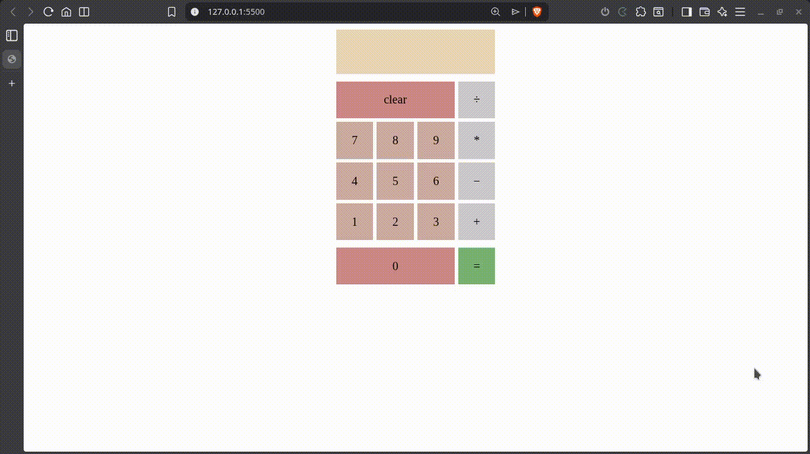

# Basic Calculator

- [Live Demo]()

## Demo

## Tasks
#### 1. create functions for the following itmes and test them in your browser's console:

- [x] add
- [x] subtract
- [x] multiply
- [x] divide   
#### 2. 
- [x] Create a new function `operate` that takes an operator and two numbers and then calls one of the above functions on the numbers.

#### 3. Create a basic HTML calculator with:
- [x] buttons for each digit and operator (including =).
- [x] Add a “clear” button.

#### 4. Create the functions that:
- [x] populate the display when you click the digit buttons
- [x] store the content of the display (the number) in a variable for use in the next step.

#### 5. Make the calculator work!
- [x] Done
